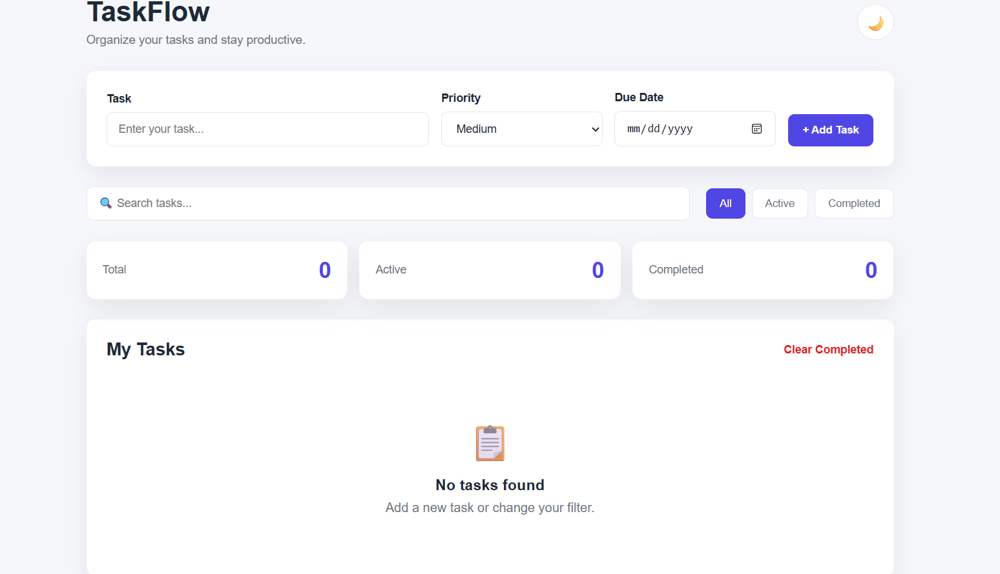

# ✅ To-Do List 

A responsive and user-friendly **To-Do List web application** developed using **HTML, CSS, and JavaScript**.

This project was created to practice front-end web development concepts such as DOM manipulation, event handling, task filtering, form validation, and browser local storage.

## 🚀 Features

* Add new tasks
* Edit existing tasks
* Delete tasks
* Mark tasks as completed
* Set task priority
* Set due dates
* Search tasks
* Filter tasks by status
* Display total, active, and completed task counts
* Clear completed tasks
* Store tasks using Local Storage
* Responsive design for different screen sizes

## 🛠️ Technologies Used

* **HTML5** – Structure of the application
* **CSS3** – Styling and responsive layout
* **JavaScript** – Application logic and interactivity
* **Local Storage** – Storing tasks in the browser

## 📂 Project Structure

```text
todo-list-pro/
│
├── index.html
├── style.css
├── script.js
└── README.md
```

## 💻 How to Run

1. Download or clone this repository.
2. Open the project folder in Visual Studio Code.
3. Open `index.html`.
4. Run the project using **Live Server** or open the file directly in a web browser.

## 🎯 Learning Objectives

This project helped me practice:

* JavaScript DOM manipulation
* JavaScript event handling
* Arrays and objects
* Functions
* Form handling and validation
* Searching and filtering data
* Local Storage
* Responsive web design
* Basic project organization using Git and GitHub

## 📸 Project Preview

Add screenshots of the application here.




## 🌐 Live Demo

Add your GitHub Pages link here:


https://Hiranya20.github.io/todo-list-pro/


## 👨‍💻 Author

**Hiranya**

IT Undergraduate
Uva Wellassa University

## 📄 License

This project is created for educational and learning purposes.
